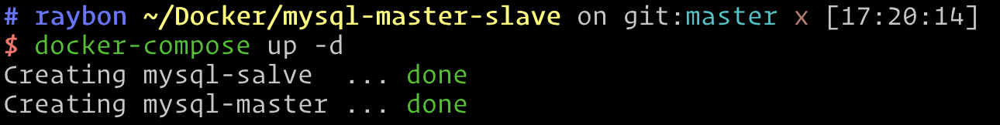
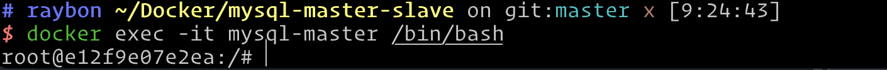
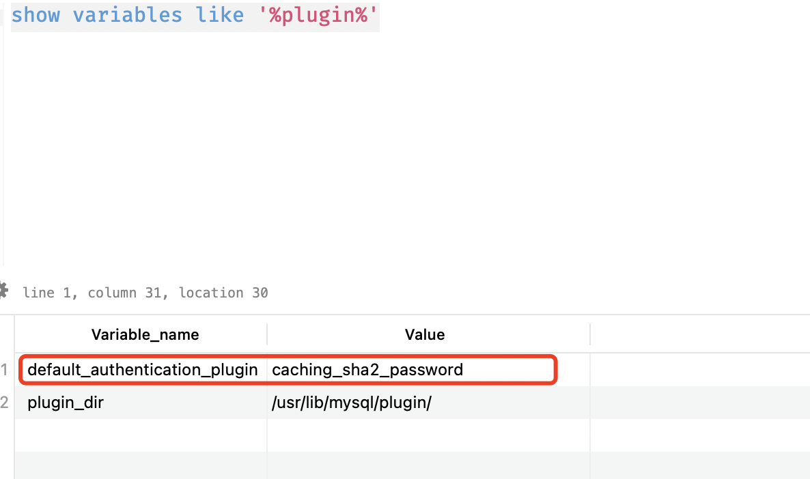
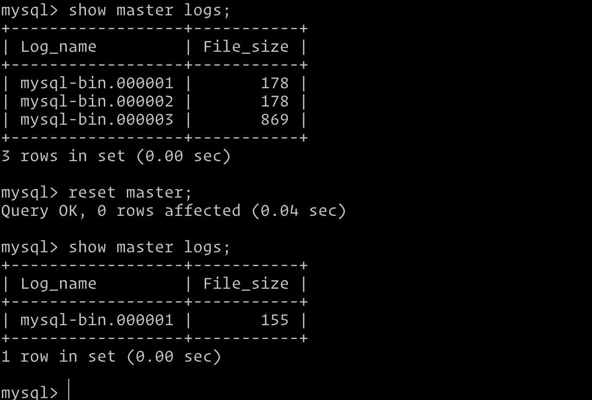
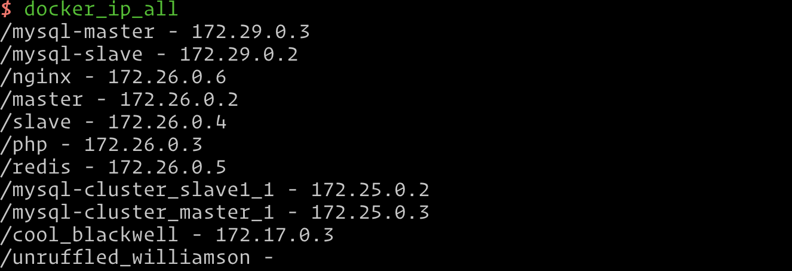
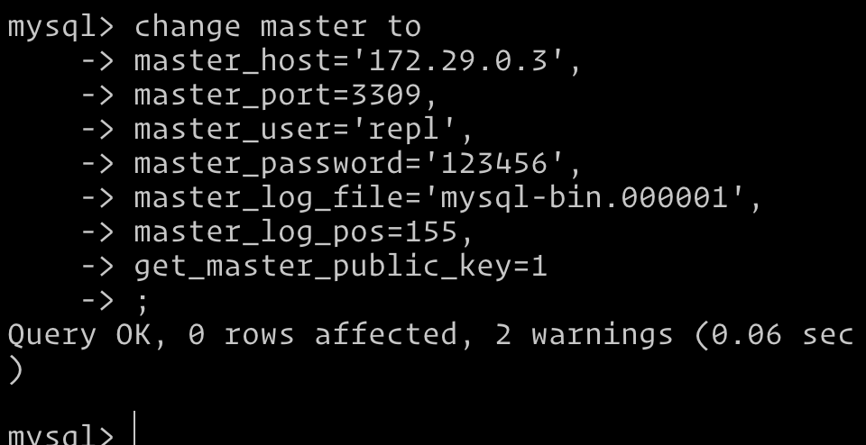
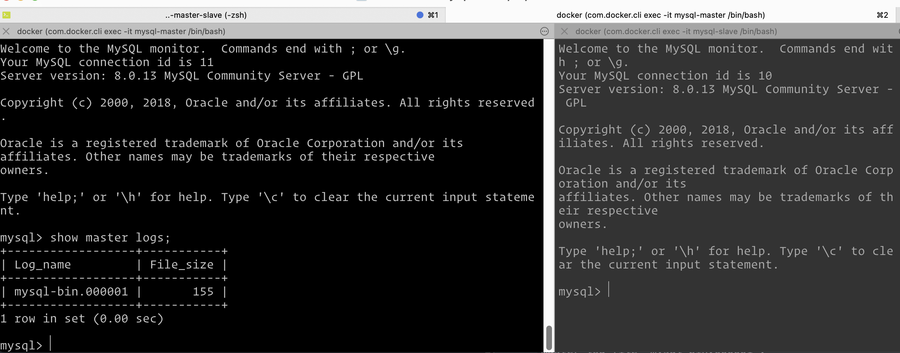
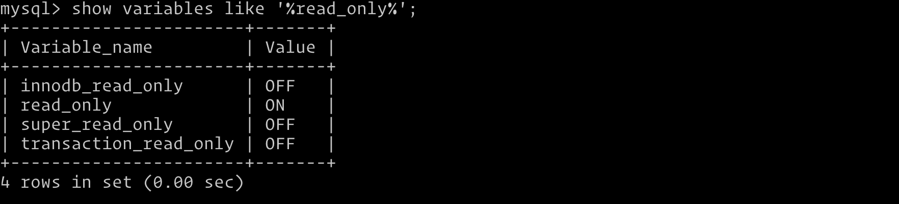
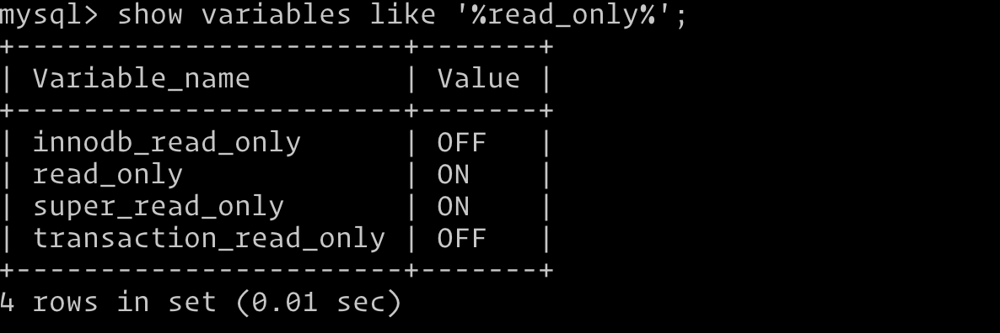
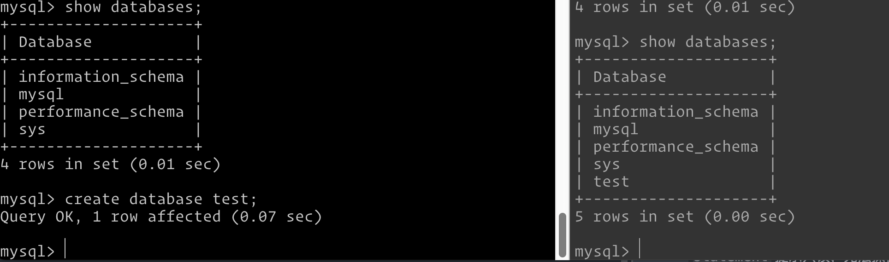

## Mysql 8.0 一主一从详细配置方案

- 本文是在Mac 下操作（Docker 自行安装）
- 使用docker-composer 进行安装 

## 一、安装

```
#下载
git clone git@github.com:Flttgo/mysql-master-slave.git

#进入子目录
cd mysql-master-slave

#开始安装
docker-compose up -d
```

看到如下效果表示启动成功
```
$ docker-compose up -d
Creating mysql-salve  ... done
Creating mysql-master ... done
```

命令行查看我们创建的镜像



```code
$ docker ps --format "table {{.ID}}\t{{.Names}}\t{{.Networks}}" --filter 'network=mysql-master-slave_default'
CONTAINER ID   NAMES          NETWORKS
09e55faa27a8   mysql-salve    mysql-master-slave_default
e12f9e07e2ea   mysql-master   mysql-master-slave_default
```


Docker 工具查看镜像：


均已正常启动，此时如果我们本地宿主机如果需要连接，配置如下：

主库：
IP： 127.0.0.1 PORT: 33060 USER: root password: 123456

从库连接方式：[只读模式]
IP： 127.0.0.1 PORT: 33070 USER: root password: 123456

## 二、创建集群复制账户【主库操作】

使用`Item2` 进行连接主库[mysql-master]

`docker exec -it mysql-master /bin/bash`



连接数据库:[我们配置的端口是3309 详情见

 `./services/mysql/master/my.cnf`]

`mysql -uroot -p123456 -P3309`


查看数据库现有用户加密方式和已有用户：

`select Host,User,Plugin from mysql.user;`


创建主从复制账户

```

# 创建复制用户
create user 'repl'@'%' identified by '123456'
# 授权赋值 复制权限
grant replication slave,replication client on *.* to 'repl'@'%';
# 刷新权限
flush privileges;

```
如果创建用户使用

 `CREATE USER 'slave'@'%' IDENTIFIED WITH 'mysql_native_password' BY '123456';`

 则在从库连接时去掉 `get_master_public_key` 参数，否则会出现 `slave connecting to master`

如图操作


再次查询用户


用户`repl` 添加成功，密码加密方式 受 `my.cnf` 内的 `default-authentication-plugin` 影响


my.cnf 配置

```
[mysqld]
#default-authentication-plugin   = mysql_native_password | caching_sha2_password （二选一，8.0 之后 默认是后者）
```

查看当前mysql 默认的密码加密方式

`show variables like '%plugin%'`




查看主库目前`binlog` 日志文件索引

`show master logs;`


重置主库日志并再次查询：

`reset master`



## 三、配置从库到主库的主从复制连接【很重要】

连接从库容器：

`docker exec -it mysql-slave /bin/bash`


连接容器内mysql[参考主库方式]:

`mysql -uroot -p123456 -P3310`


查看主库容器IP

`docker inspect --format='{{.Name}} - {{range .NetworkSettings.Networks}}{{.IPAddress}}{{end}}' $(docker ps -aq)`

我电脑使用了zsh 脚本

```text
function docker_ip_all() {
	docker inspect --format='{{.Name}} - {{range .NetworkSettings.Networks}}{{.IPAddress}}{{end}}' $(docker ps -aq)
}
```



主库IP（你们配置请根据查看到的IP定义）：

mysql-master: 172.29.0.3(主库，注意IP可能会变动)

mysql-slave: 172.29.0.2（从库，注意IP可能会变动）

最关键一步，设置从库连接主库【从库执行】：

```
change master to 
master_host='172.29.0.3',
master_port=3309,
master_user='repl',
master_password='123456',
master_log_file='mysql-bin.000001',
master_log_pos=155,
get_master_public_key=1
;
```



配置说明：

`master_log_file`：执行[主库]show master logs 看到的文件名

`m`aster_log_pos`： 执行[主库]show master logs 看到的postion

`get_master_public_key`: 使用Master主库公钥验证，此参数由1 和 0 ，1 使用 caching_sha2_password 进行密码验证 0 使用 mysql_native_password 验证，我们要看创建复制用户使用的是那个加密方式，具体参考上面创建用户

binlog 日志位置 位于mysql数据目录




执行之后查看从库是否可主库连接成功:

```
Slave_IO_Running: No 未启动
Slave_SQL_Running: No 未启动
```


启动从库命令：
1. start slave 开启从库复制线程
2. stop slave 停止复制线程
3. reset slave 重置从连接，会清理replay-log 日志

启动如下:


```
Slave_IO_Running: Yes
Slave_SQL_Running: Yes
```

看到这两个参数均为 Yes 此时代表 主从复制功能已经开启，配置工作已经结束

主从同步一定要确保 开启 `log-bin`

主程序配置参见目录env

 `MYSQL_CONF_FILE=./services/mysql/master/my.cnf`

从库配置目录env:

 `MYSQL_CONF_FILE=./services/mysql/slave/my.cnf`

 配置从库只读：

```
 # 针对super权限用户如root 具备super 权限 super_read_only 配置会默认开启 read_only 
 super_read_only=1
 # 控制非super 权限用操作
 #read_only=1
```

此时操作



此时  root 用户具备  super 权限，依然能操作数据库

我们只需要开启  super_read_only=1 注释掉 read_only =1 操作，重启即可



尝试往从库添加数据库：


`ERROR 1290 (HY000): The MySQL server is running with the --super-read-only option so it cannot execute this statement` 提示只读，无法操作，保证主从的一致性

下面我们从主库创建数据库，查看主从是否工作：



我们左侧创建主库，右侧查询 `show databases;` 可以看到已经同步成功

从库执行： `show master logs;`

得到最后一条最新的日志为： `mysql-bin.0000004`

查看日志内容：

`show binlog events in 'mysql-bin.000004'\G;`


上图中我们是能看到 创建数据库的操作语句 

## 总结

如果有同学需要用到 binlog 查看和回滚工具

[使用Mysql Binlog工具 binlog2sql](https://learnku.com/articles/75828)

中间可能会有坑，不会很顺利，端口号各种问题


